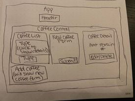

# Epicodus Help Queue

## Description
This application tracks the amount and type of bagged coffee beans remaining as they are sold.  

### Component Tree:

###  Requirements:
  * Git
  * Node Package Manager (npm)

### Command Line Setup and Installation:
* Clone project:  `$ git clone https://github.com/kariVigna/coffee-tracker.git`
* Navigate to project directory:  `$ cd coffee-tracker`
* Install project dependencies: `$ npm install`
* Run server: `$ npm run start`

## Technologies Used
* Node Package Manager (NPM)
* React 

## Known Bugs
- None at this time.

**MIT License**
Copyright (c) 2024 Kari Vigna